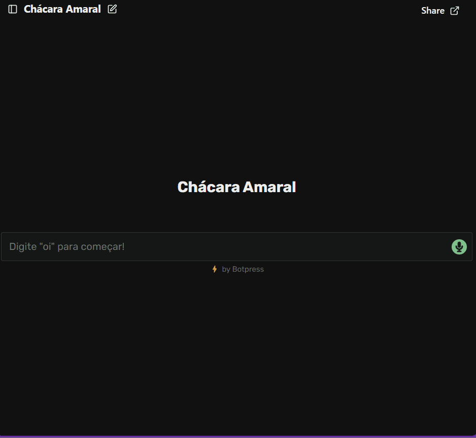

<h1 align="center">Criação de Chatbot 💬</h1> 

This is a smart <strong>conversational assistant</strong> developed for <strong>Chácara Amaral</strong>, a countryside space for leisure and events.  

 

  
  <a href="#-screenshots">Screenshots</a>&nbsp;&nbsp;&nbsp;|&nbsp;&nbsp;&nbsp;
  <a href="#-technologies">Technologies</a>&nbsp;&nbsp;&nbsp;|&nbsp;&nbsp;&nbsp;
  <a href="#-features">Features</a>&nbsp;&nbsp;&nbsp;|&nbsp;&nbsp;&nbsp;
  <a href="#-project">Project</a>&nbsp;&nbsp;&nbsp;|&nbsp;&nbsp;&nbsp;
  <a href="#-license">License</a>&nbsp;&nbsp;&nbsp;|&nbsp;&nbsp;&nbsp;
  <a href="#-contributing">Contributing</a>&nbsp;&nbsp;&nbsp;|&nbsp;&nbsp;&nbsp;
  <a href="#support">Support</a>  

 

🔗 **Acesse o chatbot online aqui:**  
👉 [Teste o chatbot](https://cdn.botpress.cloud/webchat/v2.4/shareable.html?configUrl=https://files.bpcontent.cloud/2025/05/07/16/20250507161047-TIXN3XZ6.json)

 

  

 

## 📸 Screenshots

 

## 🛠 Technologies
- [Botpress Cloud](https://botpress.com/) – visual no-code platform for building chatbots;
- HTML5 + CSS3 – to create the integration page;
- JavaScript – to configure and embed the chatbot;
- Botpress Cloud Hosting – with public config URL;
- Visual customization (icons, colors, avatar, etc.).

 

## ✨ Features

- ✨ Interface fully in **Portuguese**;
- 🤖 **Multiple-choice options** to guide user interaction;
- 📍 Answers about the property, facilities, location, and booking;
- 🔄 Reset conversation anytime;
- 🎨 Visually customized chat widget.
  
 

## 💻 Project

- The project was created as part of my academic journey in Systems Analysis and Development, with the goal of applying real-world chatbot technologies using <a href="https://botpress.com/">Botpress Cloud.</a>

 

## 📜 License

* This project is licensed under the [MIT License](https://choosealicense.com/licenses/mit/)

 

## 🫱🏻‍🫲🏻 Contributing

 Contributions, issues, and feature requests are welcome! Please, feel free to do it! 😉 

 

## 🌟 Support

 If you like this project, please give it a star ⭐ and share it with others! 😄 

